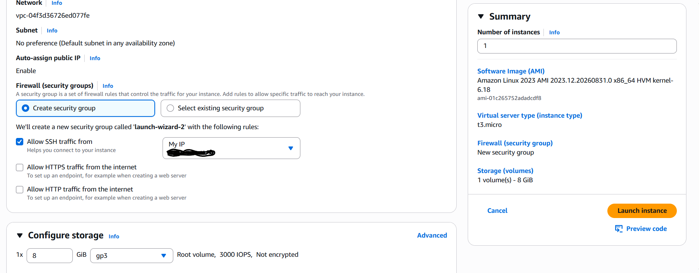
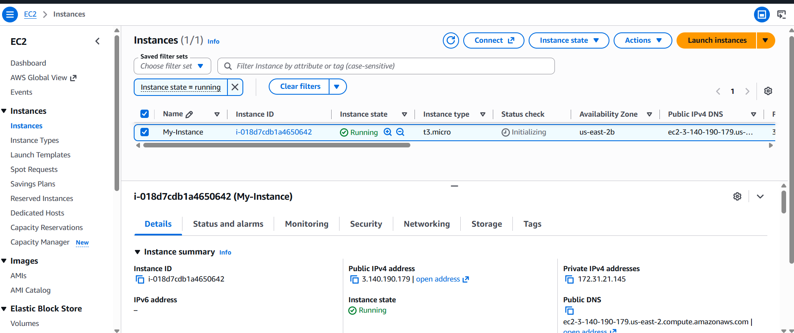
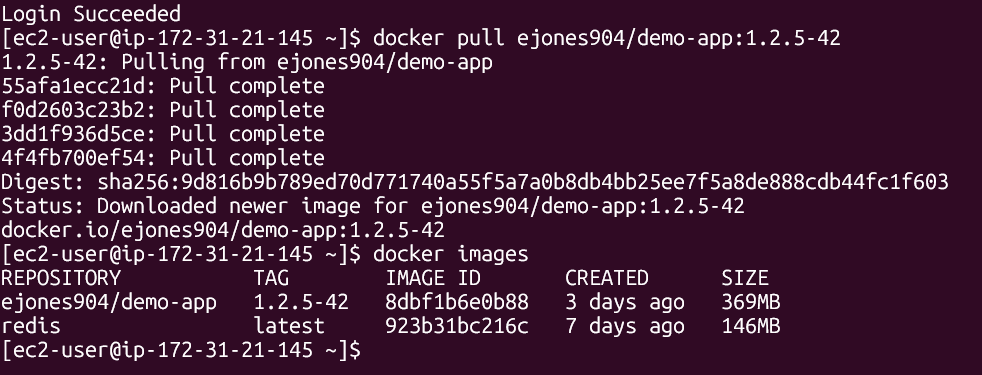
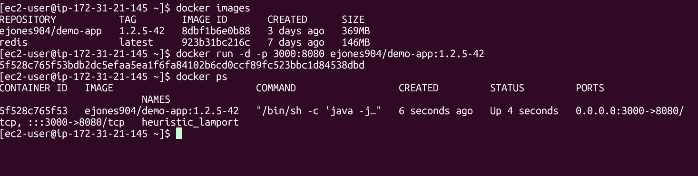
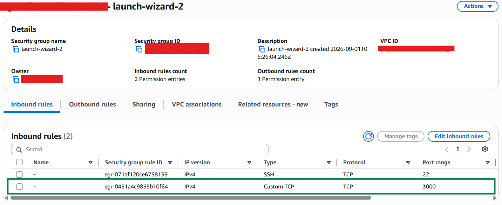
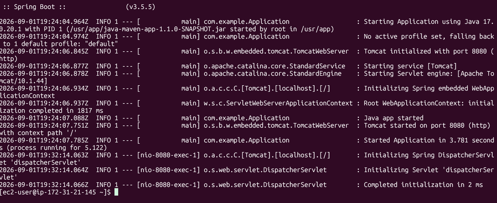
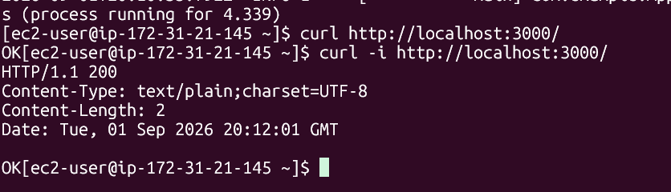
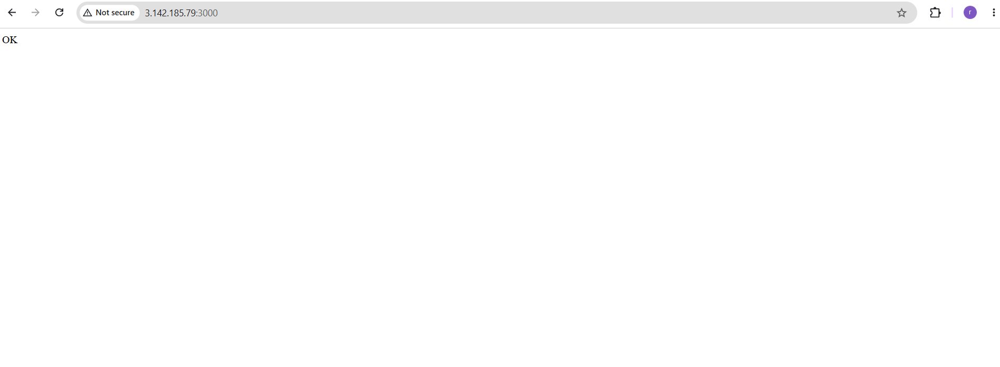

# AWS EC2 Docker Manual Deployment

## Overview

This project demonstrates the manual deployment of a containerized Spring Boot application to an AWS EC2 instance using Docker.

The objective was to work through the deployment process manually before automating it through CI/CD. This included provisioning the cloud infrastructure, configuring the Linux host, installing Docker, pulling a versioned application image from Docker Hub, configuring network access, deploying the container, troubleshooting application failures, and validating the application externally.

The final application was successfully deployed to AWS EC2 and returned:

```text
HTTP/1.1 200
OK
```

---

## Business Context

Modern CI/CD platforms can automate most application deployment steps, but those automated steps still depend on the underlying infrastructure, runtime, networking, artifacts, and application configuration being correct.

This project was designed to work through those dependencies manually.

Rather than treating deployment as a single automated action, I worked through the individual components involved:

* Cloud compute provisioning
* Linux server administration
* Secure SSH access
* Docker installation and configuration
* Container registry interaction
* Versioned image deployment
* Port mapping
* AWS Security Group configuration
* Application troubleshooting
* HTTP validation

Working through the process manually also made it possible to troubleshoot failures at the correct layer instead of treating the deployment pipeline as a black box.

---

# Architecture

```text
Developer Workstation
        |
        | Source Code
        v
    Maven Build
        |
        v
   Docker Build
        |
        v
    Docker Hub
        |
        | docker pull
        v
+-----------------------------+
|        AWS EC2              |
|                             |
|  Amazon Linux               |
|        |                    |
|        v                    |
|  Docker Engine              |
|        |                    |
|        v                    |
|  Spring Boot Container      |
|  Internal Port: 8080        |
|        |                    |
|        v                    |
|  EC2 Host Port: 3000        |
+-------------|---------------+
              |
              v
       Security Group
        TCP Port 3000
              |
              v
           Internet
              |
              v
         HTTP 200 OK
```

---

# Technologies Used

| Technology          | Purpose                         |
| ------------------- | ------------------------------- |
| AWS EC2             | Cloud compute instance          |
| Amazon Linux        | EC2 host operating system       |
| Docker              | Container runtime               |
| Docker Hub          | Container image registry        |
| Java 17             | Application runtime             |
| Spring Boot         | Application framework           |
| Maven               | Application build and packaging |
| Git/GitHub          | Source control                  |
| SSH                 | Secure EC2 administration       |
| curl                | HTTP endpoint validation        |
| AWS Security Groups | Network access control          |

---

# 1. Provisioning the EC2 Instance

I provisioned an AWS EC2 instance that would act as the deployment host for the containerized application.

The instance configuration included the operating system, instance type, SSH key pair, networking configuration, storage, and Security Group.



After provisioning, I verified that the instance entered the running state and obtained the network information required to connect to the server.



---

# 2. Securing SSH Access

The EC2 private key was stored locally rather than inside the project repository.

The key permissions were restricted before connecting:

```bash
chmod 400 ~/.ssh/Docker-Server.pem
```

The instance was then accessed using SSH:

```bash
ssh -i ~/.ssh/Docker-Server.pem ec2-user@<EC2-PUBLIC-IP>
```

The private key is intentionally excluded from this repository.

---

# 3. Preparing the Linux Host

Once connected to the EC2 instance, I verified that the operating system packages were current:

```bash
sudo yum update
```

Docker was then installed:

```bash
sudo yum install docker
```

The Docker service was started:

```bash
sudo service docker start
```

I verified that the Docker daemon was running before continuing with the deployment.

---

# 4. Configuring Non-Root Docker Access

Rather than requiring `sudo` for every Docker command, I added the EC2 user to the Docker group:

```bash
sudo usermod -aG docker $USER
```

After reconnecting to the EC2 instance, Docker commands could be executed as the standard `ec2-user`.

Docker functionality was initially validated by pulling and running a Redis container.

This provided a simple way to verify that:

* Docker was installed correctly
* The Docker daemon was running
* The EC2 instance could communicate with a container registry
* The user had permission to manage containers

---

# 5. Pulling the Application Image

The application had already been packaged as a versioned Docker image and pushed to Docker Hub.

From the EC2 instance, I pulled the application image:

```bash
docker pull ejones904/demo-app:1.2.5-42
```

I then verified the image:

```bash
docker images
```

The EC2 instance successfully downloaded the application image from Docker Hub.



Using version-specific Docker tags allowed the exact application artifact being deployed to be identified rather than relying on a generic `latest` tag.

---

# 6. Deploying the Application Container

The application was started with Docker:

```bash
docker run -d -p 3000:8080 ejones904/demo-app:1.2.5-42
```

The port mapping:

```text
3000:8080
```

means:

```text
EC2 Host Port 3000
        |
        v
Container Port 8080
        |
        v
Spring Boot / Tomcat
```

I verified the running container with:

```bash
docker ps
```

Docker confirmed the mapping:

```text
0.0.0.0:3000->8080/tcp
```



---

# 7. Configuring AWS Network Access

The EC2 Security Group was updated to permit inbound TCP traffic to port `3000`.

This allowed external requests to reach:

```text
EC2 :3000
   |
   v
Docker :8080
   |
   v
Spring Boot
```



For testing, access was restricted where practical rather than unnecessarily exposing services to unrestricted inbound traffic.

---

# 8. Validating the Spring Boot Application

Container logs were inspected to verify that the Java application had started successfully:

```bash
docker logs <container>
```

The logs confirmed:

```text
Tomcat initialized with port 8080
Java app started
Tomcat started on port 8080
Started Application
```



At this point:

* EC2 was running
* Docker was running
* The container was running
* Port mapping was correct
* Tomcat was listening on port 8080
* External traffic could reach the application

However, the first browser request did not return the expected application response.

---

# 9. Troubleshooting HTTP 404

The first external request reached Spring Boot but returned:

```text
Whitelabel Error Page

status=404
Not Found
```

This was an important distinction.

Because the Spring Boot Whitelabel page was being returned, the request had already successfully passed through:

```text
Internet
   |
   v
AWS Security Group
   |
   v
EC2 Port 3000
   |
   v
Docker Port Mapping
   |
   v
Container Port 8080
   |
   v
Spring Boot
```

That meant the problem was no longer likely to be AWS networking or Docker.

I inspected the application source and found:

```java
public String getStatus() {
    return "OK";
}
```

The method existed, but Spring had not been instructed to expose it as an HTTP endpoint.

I updated the application to use:

```java
@RestController
```

and:

```java
@GetMapping("/")
public String getStatus() {
    return "OK";
}
```

This mapped an HTTP GET request to `/` to the application's status method.

---

# 10. Rebuilding the Application Artifact

After changing the application code, I initially rebuilt the Docker image.

The redeployed application continued returning a 404.

This led to another important discovery: changing the Java source did not automatically update the previously generated Maven artifact that Docker was packaging.

I rebuilt the application:

```bash
mvn clean package
```

and then rebuilt the Docker image without relying on cached layers:

```bash
docker build --no-cache -t ejones904/demo-app:<NEW-TAG> .
```

The new version was pushed to Docker Hub and pulled onto the EC2 instance.

---

# 11. Troubleshooting ClassNotFoundException

During the next deployment attempt, the new container failed to accept connections.

Instead of immediately changing the AWS networking configuration, I checked the container state and logs:

```bash
docker ps -a
docker logs demo-app
```

The logs revealed:

```text
java.lang.ClassNotFoundException: com.example.Application
```

The application source was located at:

```text
src/main/java/com/example/Application.java
```

but the Java package declaration needed to match the expected package structure.

The application was corrected to include:

```java
package com.example;
```

Before rebuilding the Docker image again, I verified that the compiled application class existed inside the generated JAR:

```bash
jar tf target/*.jar | grep Application.class
```

The expected class path was:

```text
BOOT-INF/classes/com/example/Application.class
```

The Maven artifact and Docker image were then rebuilt and a new version was pushed to Docker Hub.

---

# 12. Redeploying the Corrected Image

The corrected image was pulled onto EC2 and deployed:

```bash
docker pull ejones904/demo-app:<CORRECTED-TAG>

docker run -d \
  --name demo-app \
  -p 3000:8080 \
  ejones904/demo-app:<CORRECTED-TAG>
```

The application was first tested from inside the EC2 instance:

```bash
curl http://localhost:3000/
```

Result:

```text
OK
```

I then requested the full HTTP response:

```bash
curl -i http://localhost:3000/
```

The application returned:

```text
HTTP/1.1 200
Content-Type: text/plain;charset=UTF-8
Content-Length: 2

OK
```



---

# 13. Public Application Validation

Finally, I accessed the application externally through the EC2 public endpoint:

```text
http://<EC2-PUBLIC-IP>:3000/
```

The browser successfully returned:

```text
OK
```



This confirmed the complete deployment path was operational:

```text
Docker Hub
     |
     v
AWS EC2
     |
     v
Docker Engine
     |
     v
Spring Boot Container :8080
     |
     v
EC2 Host :3000
     |
     v
AWS Security Group
     |
     v
Public Client
     |
     v
HTTP 200 OK
```

---

# Troubleshooting Summary

Two application-level issues were identified during deployment.

### HTTP 404

**Symptom**

The application returned the Spring Boot Whitelabel 404 page.

**Investigation**

The response proved that requests were already successfully reaching Spring Boot.

This allowed AWS networking, Security Group configuration, Docker networking, and Tomcat startup to be separated from the application-layer problem.

**Root Cause**

The Java status method had not been mapped to an HTTP endpoint.

**Resolution**

Added:

```java
@RestController
@GetMapping("/")
```

and rebuilt the Maven artifact and Docker image.

---

### ClassNotFoundException

**Symptom**

The newly deployed container stopped responding on port 3000.

**Investigation**

Container logs showed:

```text
java.lang.ClassNotFoundException: com.example.Application
```

**Root Cause**

The Java package structure did not match the application's expected main class.

**Resolution**

Corrected the Java package declaration, rebuilt the Maven artifact, verified the compiled class inside the JAR, rebuilt the Docker image, pushed a new image version, and redeployed it.

---

# Key Takeaways

This project reinforced an important principle for me: a failed web request does not automatically mean there is a networking problem.

The initial 404 was actually evidence that much of the infrastructure was already working.

By troubleshooting the deployment layer by layer, I was able to distinguish between:

```text
Infrastructure
Networking
Container Runtime
Port Mapping
Application Runtime
Application Routing
Build Artifact
```

That made it possible to isolate the actual failure instead of repeatedly changing infrastructure that was already functioning correctly.

The project also reinforced why understanding manual deployment matters before automating deployment through CI/CD.

A CI/CD pipeline still needs to know:

* What application artifact to build
* How to build the Docker image
* Where to publish the image
* Which image version to deploy
* Which host should run it
* Which ports should be mapped
* Which network traffic should be permitted
* How to determine whether the application actually started successfully

Automation removes manual execution. It does not remove the need to understand the deployment architecture.

---

# Skills Demonstrated

* AWS EC2 provisioning
* AWS Security Groups
* Linux server administration
* SSH key-based authentication
* Docker installation and configuration
* Docker image management
* Docker Hub
* Container deployment
* Docker port mapping
* Maven builds
* Spring Boot
* Java application troubleshooting
* Container log analysis
* HTTP troubleshooting
* Application-layer vs. infrastructure-layer fault isolation
* Versioned artifact deployment
* End-to-end cloud application validation

---

## Final Result

The containerized Spring Boot application was successfully deployed to AWS EC2 and validated both locally from the EC2 host and externally through the EC2 public endpoint.

```text
HTTP/1.1 200
OK
```

The deployment demonstrated the complete path from a versioned Docker artifact to a publicly accessible cloud-hosted application.

